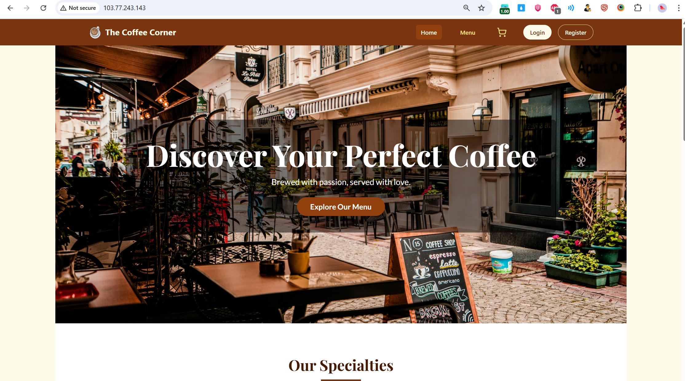
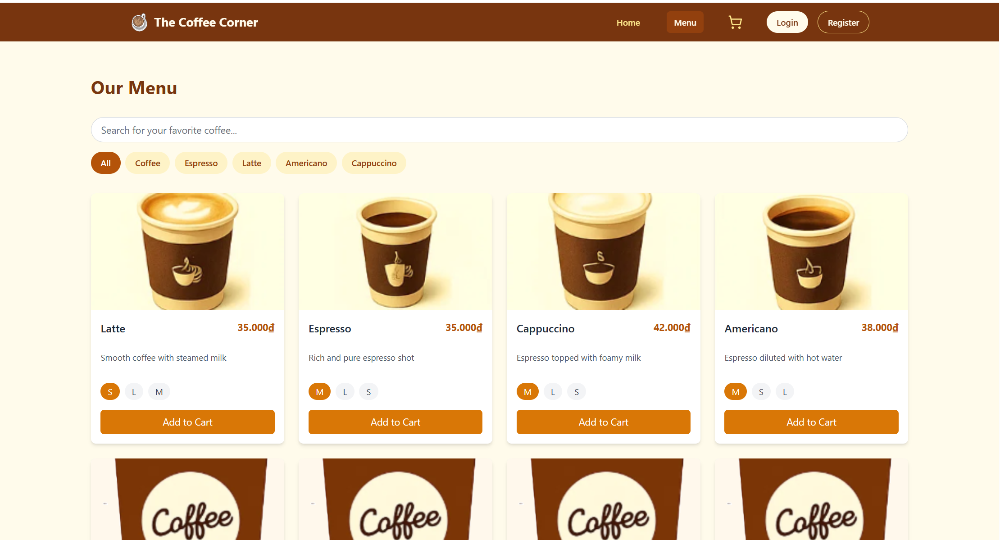
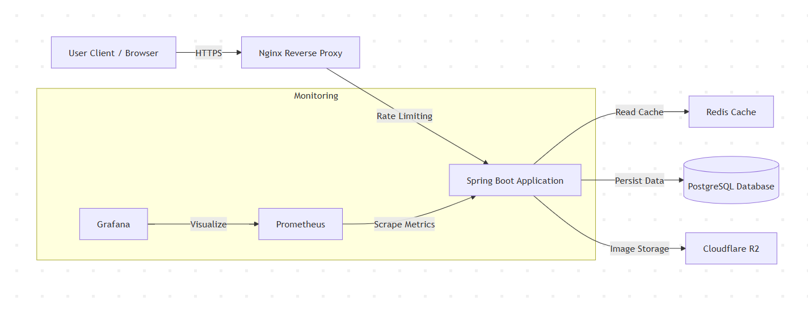
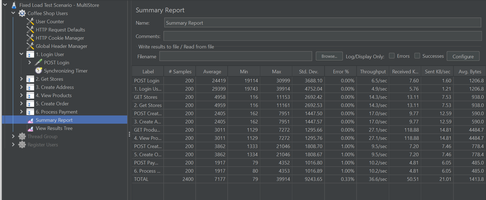
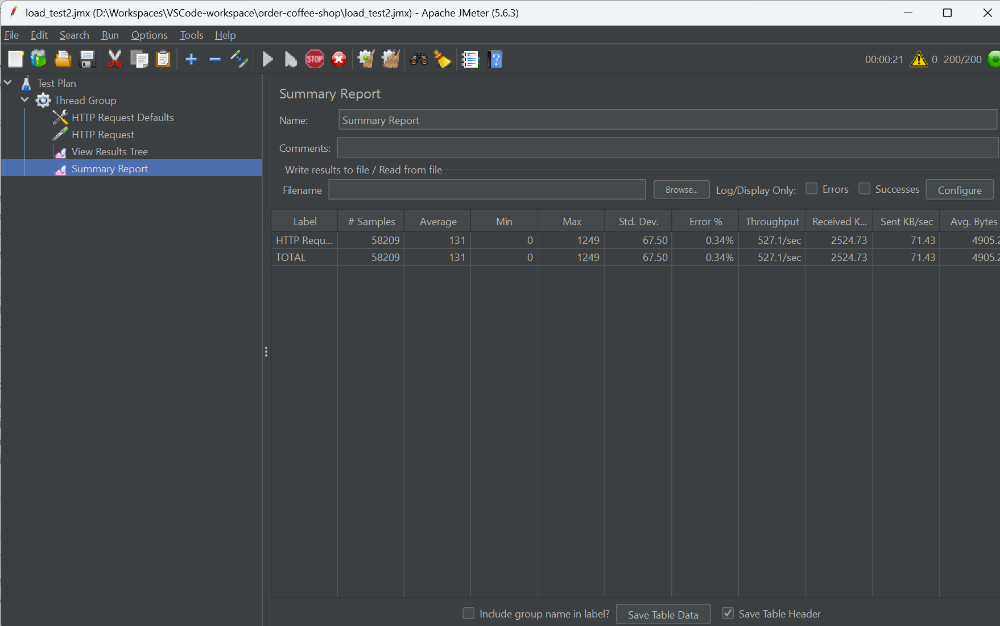

# ☕ Coffee Shop Chain Management System

> **High-Performance Backend for Multi-store Coffee Chain (Spring Boot 3 & Redis)**

[](https://www.java.com/)
[](https://spring.io/projects/spring-boot)
[](https://www.postgresql.org/)
[](https://redis.io/)
[](https://www.docker.com/)

---

## 📖 Introduction

This project is a comprehensive backend solution designed for a Coffee Shop chain with **6 branches** (scalable to 80+). Unlike traditional CRUD applications, this system focuses on **Scalability**, **Data Consistency**, and **Resource Efficiency** on limited hardware.

The system allows users to automatically find the nearest store based on their location, view store-specific inventory, and place orders with high concurrency stability.

---

## 🌐 Live Demo & Deployment

The live application is deployed on a VPS with the following configuration:

-   **Specs:** 2 vCPU, 2GB RAM, 50GB SSD
-   **URL:** [http://103.77.243.143/](http://103.77.243.143/)

---

## 🖼️ Application UI

Here's a glimpse of the user interface:

| Home Page | Menu Page |
| :---: | :---: |
|  |  |

---

## 🏗️ System Architecture

The system is deployed using a classic monolithic architecture optimized for performance.



-----

## 🚀 Key Technical Highlights

### 1\. High Performance with Redis Caching

  - **Problem:** Database CPU spiked to 40% when handling frequent "View Menu" requests.
  - **Solution:** Implemented **Redis Cache-Aside pattern** for Product Listing & Details APIs.
  - **Result:**
      - Average Response Time dropped from **~200ms** to **<30ms** (Cache Hit).
      - CPU usage reduced significantly, allowing the system to handle higher throughput.

### 2\. Concurrency Control (Pessimistic Locking)

  - **Problem:** Race condition occurred when multiple users ordered the last item in stock simultaneously (Flash Sale scenario).
  - **Solution:** Applied **Pessimistic Locking (`SELECT ... FOR UPDATE`)** at the Database level within the Order Transaction.
  - **Result:** Ensures **100% Data Consistency**. Zero "negative stock" issues during stress tests.

### 3\. Multi-Store Inventory Architecture

  - **Design:** Instead of a simple `quantity` field, the system uses a `product_stocks` table linking `Store` and `ProductVariant`.
  - **Logic:** Implemented **Haversine formula** to calculate distance and automatically route orders to the nearest store (within 20km radius).

### 4\. Infrastructure & Monitoring

  - **Deployment:** Manual deployment on Ubuntu VPS with Systemd services for high availability.
  - **Monitoring:** Integrated **Prometheus** & **Grafana** to monitor Real-time CPU, RAM, and JVM metrics.
  - **Security:** Nginx configured for Reverse Proxy, Rate Limiting (Anti-DDoS), and SSL termination (via ngrok for dev/demo).

-----

## 📊 Performance Benchmarks (Load Testing)

I conducted rigorous Stress Tests using **Apache JMeter** to validate system stability on low-spec hardware (**2 vCPU, 2GB RAM**).

### Scenario: Full Order Process Load Test

This test simulates 200 concurrent users logging in, creating addresses, browsing products, and placing orders.

> **Proof of Performance (Full Order Process):**
>
> 

### System Health during Redis Cache Load Test

This test focuses on read-heavy requests to the product menu to measure the effectiveness of the Redis cache. The Grafana dashboard below shows stable CPU and memory usage during the test.

> **Proof of Monitoring (Redis Cache Test):**
>
> 

-----

## 🛠️ Tech Stack

| Category | Technologies |
| :--- | :--- |
| **Language** | Java 17 |
| **Framework** | Spring Boot 3, Spring Security, Spring Data JPA |
| **Database** | PostgreSQL 16, Redis (Cache) |
| **Tools** | Docker, Maven, Git, Postman |
| **Testing** | Apache JMeter, Locust |
| **DevOps** | Linux (Ubuntu), Nginx, Prometheus, Grafana |
| **Services** | VNPAY (Payment), Cloudflare R2 (Storage), VietMap API (Map) |

-----

## 🏃‍♂️ How to Run (Local Development)

### Prerequisites

  - JDK 17+
  - Docker & Docker Compose
  - PostgreSQL & Redis

### Steps

1.  **Clone the repository**

    ```bash
    git clone https://github.com/thuanDaoSE/order-coffee-shop.git
    cd order-coffee-shop
    ```

2.  **Configure Environment**

      - The project contains two main parts: `ordercoffeeshopbackend` and `ordercoffeeshopfrontend`.
      - Follow the `README.md` file in each sub-directory for specific setup instructions.

3.  **Start Infrastructure (DB & Redis)**

    From the root directory, run:
    ```bash
    docker-compose up -d
    ```

4.  **Run the Applications**

    - Run the backend server (instructions in `ordercoffeeshopbackend/README.md`).
    - Run the frontend development server (instructions in `ordercoffeeshopfrontend/README.md`).

-----

## 📬 Contact

  - **Author:** Dao Dang Thuan
  - **Email:** daodangthuan.se@gmail.com
  - **GitHub:** [thuanDaoSE](https://github.com/thuanDaoSE)

-----

*This project was developed as a Capstone Project to demonstrate Advanced Backend Engineering skills.*
